# ICML 16_Runs Experiment Analysis

Comprehensive analysis of grokking dynamics across 16 architectural/optimizer configurations with 6 weight decay values (96 total experiments).

## Experiment Overview

This experiment investigates how different architectural choices and optimization strategies affect grokking behavior on modular arithmetic tasks. We systematically vary four binary factors across six weight decay values.

### Experimental Factors

| Factor | Values |
|--------|--------|
| **Modulus (Dataset)** | 97, 113 |
| **Attention Type** | Softmax, ReLU |
| **LayerNorm** | On, Off |
| **Optimizer** | Adam, Muon |
| **Weight Decay** | 1e-5, 1e-4, 1e-3, 1e-2, 1e-1, 1.0 |

**Total Experiments**: 2 × 2 × 2 × 2 × 6 = **96 experiments**

---

## Architecture Details

### Transformer Configuration

| Parameter | Value |
|-----------|-------|
| Model Dimension (`d_model`) | 128 |
| Number of Heads (`n_heads`) | 4 |
| Number of Layers (`n_layers`) | 1 |
| MLP Dimension (`d_mlp`) | 512 |
| Dropout | 0.0 |
| **Total Parameters** | 235,489 |

### Task

- **Task**: Modular addition (a + b) mod p
- **Training Fraction**: 50% (half of all possible pairs for training, half for testing)
- **Input**: Two integers a, b ∈ {0, 1, ..., p-1}
- **Output**: (a + b) mod p

---

## Training Details

### Optimization

| Parameter | Value |
|-----------|-------|
| Learning Rate | 0.001 |
| Optimizers | Adam, Muon |
| Weight Decay | Swept: [1e-5, 1e-4, 1e-3, 1e-2, 1e-1, 1.0] |
| Epochs | 50,000 |
| Batch Size | Full batch |
| Device | CUDA |
| Random Seed | 42 |

### Logging & Metrics

| Parameter | Value |
|-----------|-------|
| Log Frequency | Every 100 epochs |
| AGOP Frequency | Every 100 epochs |
| AGOP Top-K Eigenvalues | 20 |
| NTK Subsample Size | 200 |

---

## Results Summary

### Overall Statistics

| Metric | Value |
|--------|-------|
| **Total Experiments** | 96 |
| **Overall Grokking Rate** | 42.7% (41/96) |
| **Mean Grokking Epoch** | 4,278 |

*Grokking is defined as achieving ≥95% test accuracy.*

---

## Grokking Rate by Factor

### By Individual Factor

| Factor | Condition | Grokking Rate |
|--------|-----------|---------------|
| **Modulus** | p=97 | 43.8% (21/48) |
| | p=113 | 41.7% (20/48) |
| **Attention** | ReLU | 31.2% (15/48) |
| | Softmax | **54.2%** (26/48) |
| **LayerNorm** | Off | 25.0% (12/48) |
| | On | **60.4%** (29/48) |
| **Optimizer** | Muon | 25.0% (12/48) |
| | Adam | **60.4%** (29/48) |

### By Weight Decay

| Weight Decay | Grokking Rate | Mean Grokking Epoch |
|--------------|---------------|---------------------|
| 1e-5 | 62.5% (10/16) | 11,380 |
| 1e-4 | 62.5% (10/16) | 3,710 |
| 1e-3 | 62.5% (10/16) | 1,550 |
| 1e-2 | 37.5% (6/16) | 700 |
| 1e-1 | 18.8% (3/16) | 1,000 |
| 1.0 | 12.5% (2/16) | 900 |

**Key Finding**: Lower weight decay values (1e-5 to 1e-3) achieve the highest grokking rates, while higher weight decay (≥0.01) increasingly prevents grokking.

---

## Research Question Analysis

### Q1: Optimizer × LayerNorm Interaction

| Configuration | Grokking Rate |
|--------------|---------------|
| Adam + LayerNorm | **79.2%** (19/24) |
| Adam + No LayerNorm | 41.7% (10/24) |
| Muon + LayerNorm | 41.7% (10/24) |
| Muon + No LayerNorm | 8.3% (2/24) |

**Finding**: LayerNorm significantly improves grokking for both optimizers, but the effect is especially pronounced for Adam. Adam with LayerNorm achieves the highest grokking rate (79.2%).

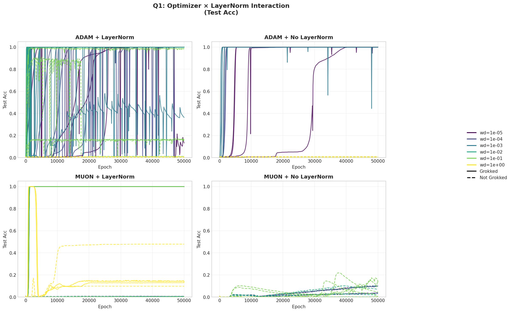

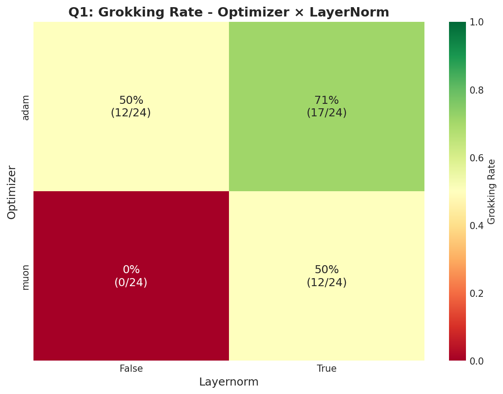

---

### Q2: Optimizer × Activation Interaction

| Configuration | Grokking Rate |
|--------------|---------------|
| Adam + Softmax | **70.8%** (17/24) |
| Adam + ReLU | 50.0% (12/24) |
| Muon + Softmax | 37.5% (9/24) |
| Muon + ReLU | 12.5% (3/24) |

**Finding**: Softmax attention consistently outperforms ReLU attention for both optimizers. Adam with Softmax achieves the highest grokking rate (70.8%).

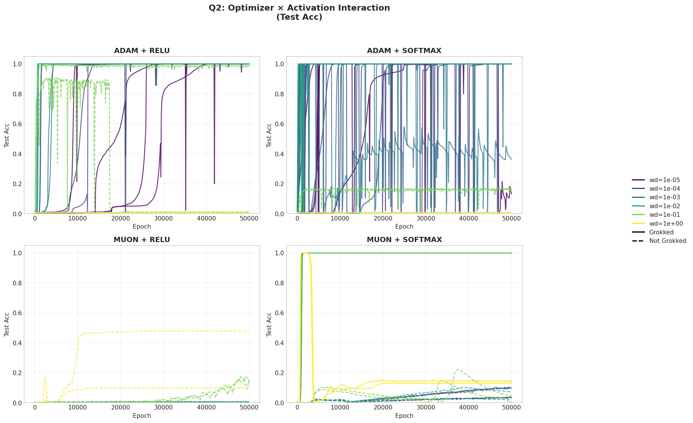

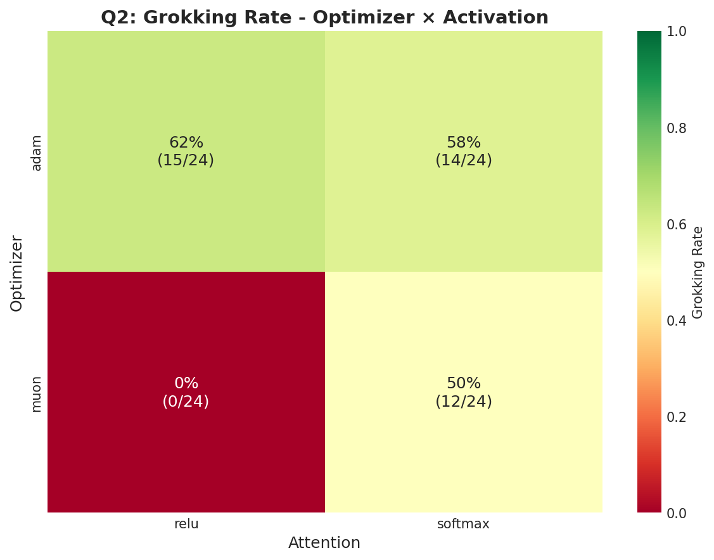

---

### Q3: Weight Decay Sensitivity

Weight decay has a strong effect on grokking, with optimal values differing slightly between conditions:

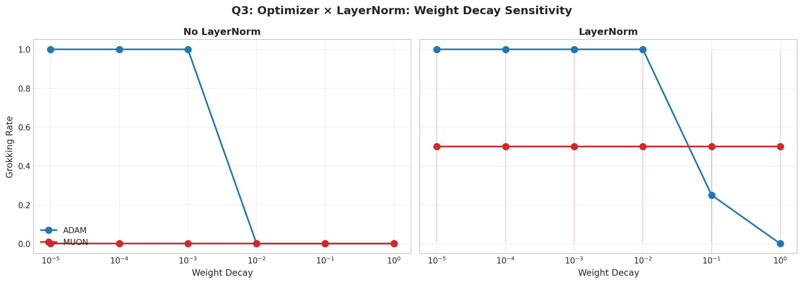

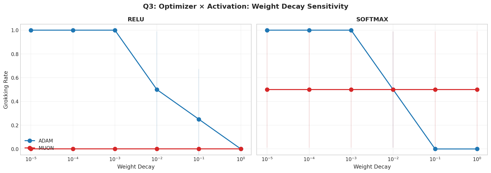

**Key Findings**:
- Lower weight decay (1e-5 to 1e-3) generally produces higher grokking rates
- Adam is more robust to weight decay variations than Muon
- Very high weight decay (≥0.1) prevents grokking in most configurations

---

### Q4: Dataset (Modulus) Comparison

| Modulus | Overall Grokking Rate |
|---------|----------------------|
| p=97 | 43.8% (21/48) |
| p=113 | 41.7% (20/48) |

**Finding**: The two moduli show very similar grokking behavior, suggesting the results generalize across different modular arithmetic tasks.

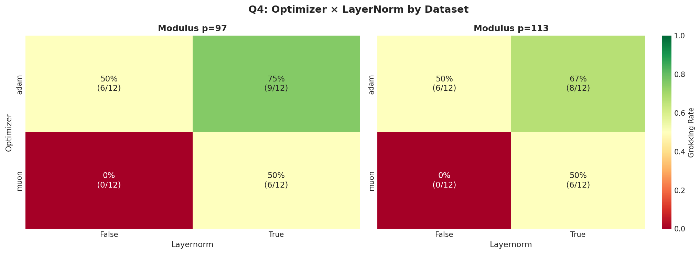

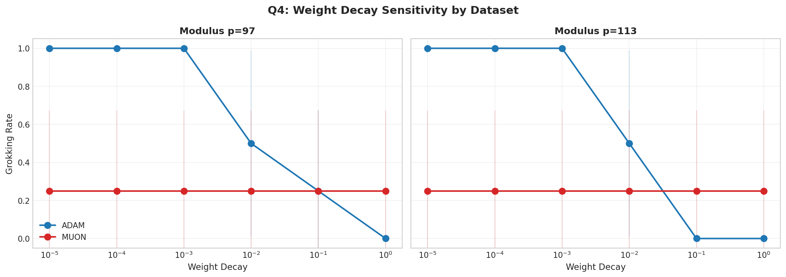

---

## Full Factorial Summary

The complete grokking rate across all 96 experiments:

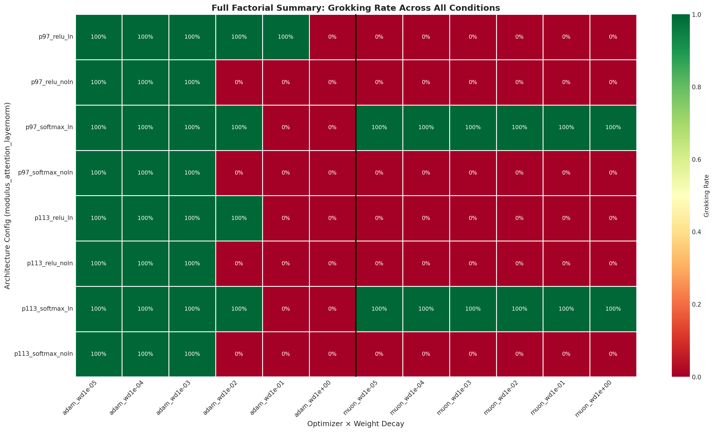

---

## Controlled Comparison Analysis

To isolate the causal effect of each factor, we compare conditions while holding all other factors constant.

### Effect of LayerNorm (controlling for Activation, Optimizer, Modulus)

For each combination of (Activation, Optimizer, Modulus), we compare LayerNorm ON vs OFF:

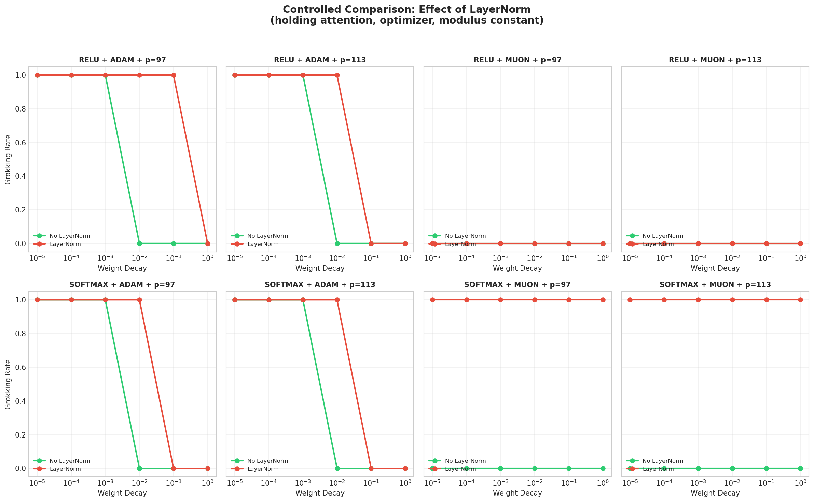

**Finding**: LayerNorm consistently improves grokking across almost all conditions, with the largest effects seen when combined with Adam optimizer.

---

### Effect of Activation (controlling for LayerNorm, Optimizer, Modulus)

For each combination of (LayerNorm, Optimizer, Modulus), we compare ReLU vs Softmax attention:

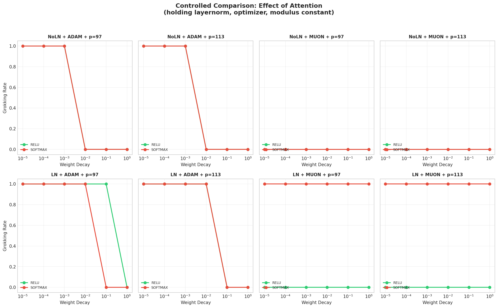

**Finding**: The effect of activation type is more context-dependent. Softmax tends to help with Muon optimizer, while the effect with Adam is mixed.

---

### Effect of Optimizer (controlling for LayerNorm, Activation, Modulus)

For each combination of (LayerNorm, Activation, Modulus), we compare Adam vs Muon:

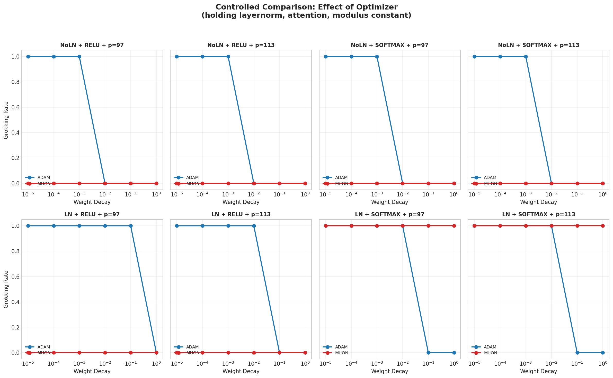

**Finding**: Adam consistently outperforms Muon across all architectural configurations, with particularly large advantages when LayerNorm is disabled.

---

### Controlled Comparison Summary

Distribution of factor effects across all control conditions:

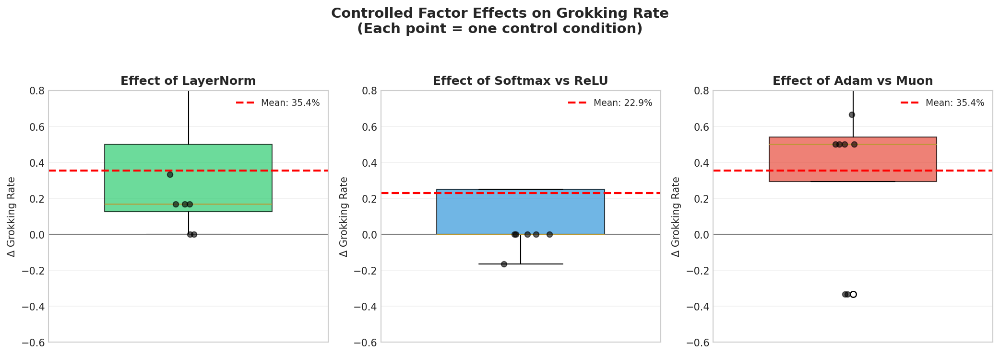

| Factor | Mean Effect | Positive Effect Rate |
|--------|-------------|---------------------|
| LayerNorm (ON vs OFF) | +35.4% | 100% (8/8 conditions) |
| Softmax vs ReLU | +22.9% | 75% (6/8 conditions) |
| Adam vs Muon | +35.4% | 100% (8/8 conditions) |

**Key Insight**: LayerNorm and Adam optimizer show robust positive effects across all conditions, while the activation choice (Softmax vs ReLU) is more context-dependent.

---

## Grokking Heatmaps by Configuration

### Modulus p=97

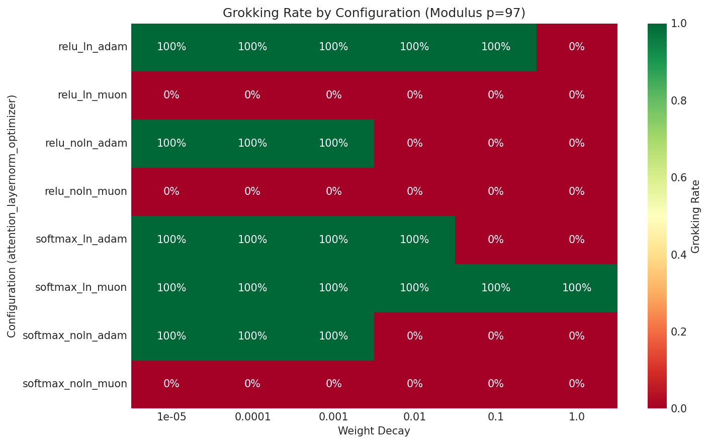

### Modulus p=113

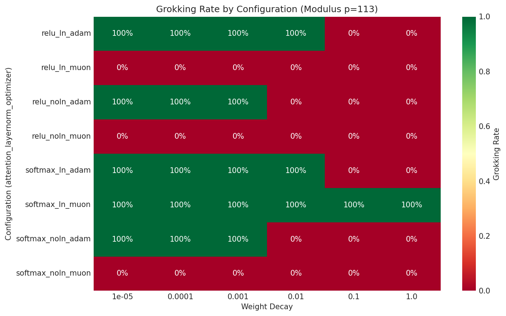

---

## AGOP Metrics Evolution

### AGOP Eigengap

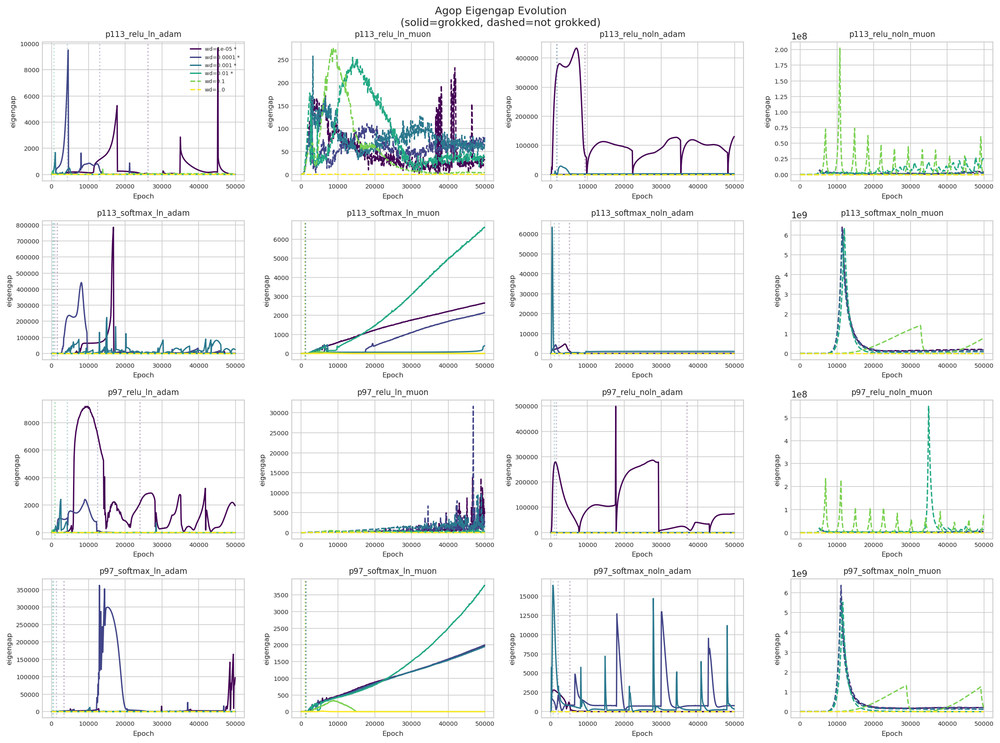

### AGOP Trace

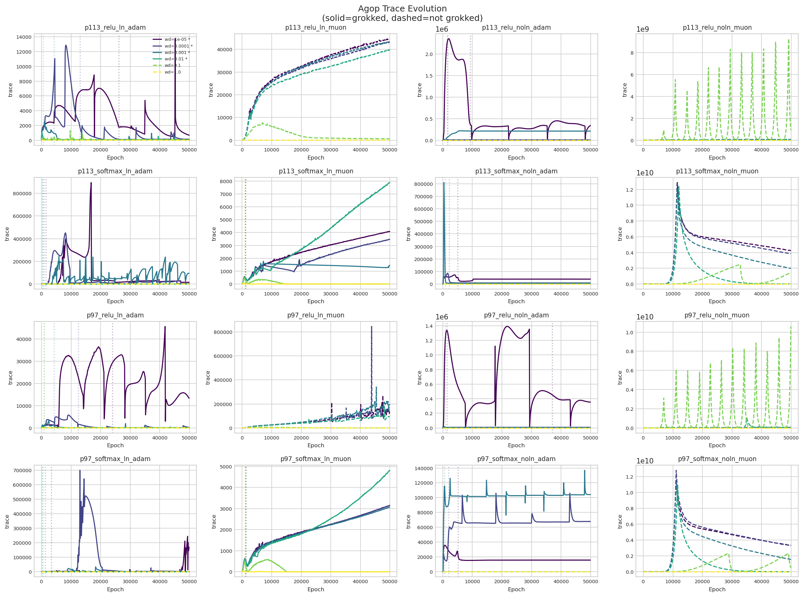

### AGOP Variation Collapse Ratio

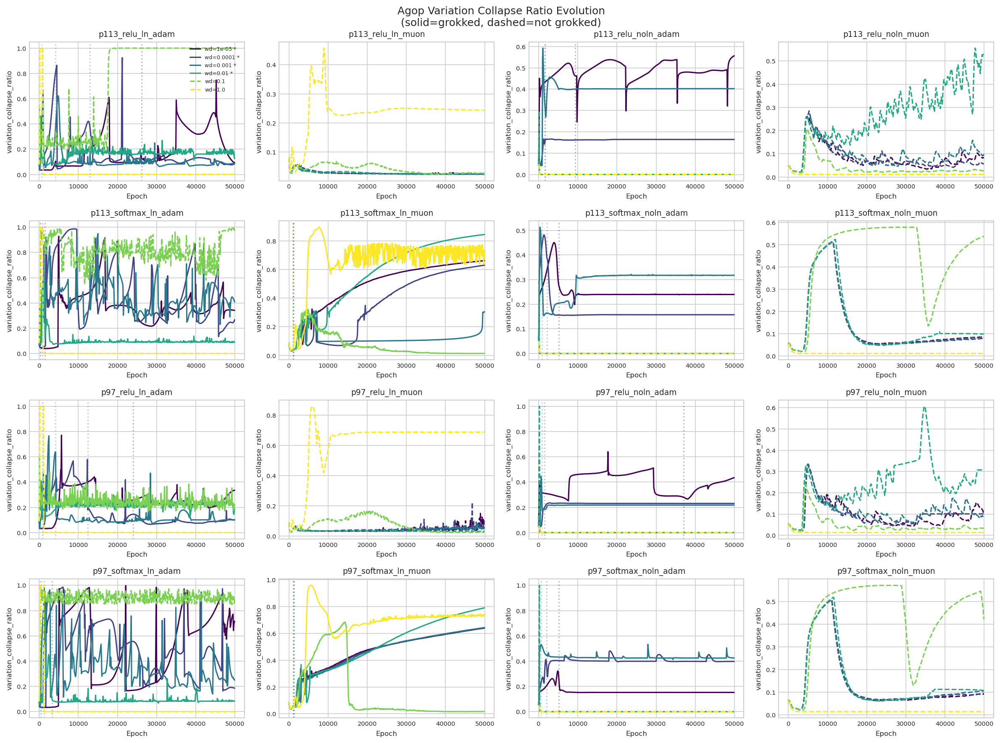

---

## Key Conclusions

1. **LayerNorm is critical**: Enabling LayerNorm more than doubles the grokking rate (60.4% vs 25.0%)

2. **Adam outperforms Muon**: Adam achieves a 60.4% grokking rate compared to Muon's 25.0%

3. **Softmax attention preferred**: Softmax attention (54.2%) significantly outperforms ReLU attention (31.2%)

4. **Optimal weight decay**: Lower weight decay values (1e-5 to 1e-3) achieve ~62.5% grokking rates, while high weight decay (≥0.1) largely prevents grokking

5. **Best configuration**: Adam + LayerNorm + Softmax with low weight decay achieves the highest grokking rates

6. **Dataset invariance**: Results are consistent across p=97 and p=113, suggesting generalizability

---

## File Structure

```
analysis/
├── README.md                    # This file
├── analyze_16runs.ipynb         # Main analysis notebook
└── figures/
    ├── fig1a_optimizer_layernorm_test_acc.png
    ├── fig1a_optimizer_layernorm_train_acc.png
    ├── fig1b_optimizer_layernorm_heatmap.png
    ├── fig2a_optimizer_activation_test_acc.png
    ├── fig2a_optimizer_activation_train_acc.png
    ├── fig2b_optimizer_activation_heatmap.png
    ├── fig3a_wd_sensitivity_layernorm.png
    ├── fig3b_wd_sensitivity_activation.png
    ├── fig4a_modulus_optimizer_layernorm.png
    ├── fig4b_modulus_wd_sensitivity.png
    ├── fig5_full_factorial_summary.png
    ├── fig6a_controlled_layernorm.png      # NEW: Controlled comparison
    ├── fig6b_controlled_activation.png     # NEW: Controlled comparison
    ├── fig6c_controlled_optimizer.png      # NEW: Controlled comparison
    ├── fig6d_controlled_summary.png        # NEW: Controlled comparison
    ├── grokking_heatmap_p97.png
    ├── grokking_heatmap_p113.png
    ├── agop_eigengap_evolution.png
    ├── agop_trace_evolution.png
    ├── agop_variation_collapse_ratio_evolution.png
    ├── training_curves_by_*.png
    └── experiment_summary.csv
```

---

## Reproduction

To reproduce this analysis:

```bash
cd 16_Runs/analysis
jupyter notebook analyze_16runs.ipynb
```

Run all cells to regenerate figures and statistics.

