# Power AGOP Study: Grokking and Input-Gradient Sensitivity

This study investigates whether **grokking** (delayed generalization after overfitting) corresponds to **concentration of input-gradient sensitivity**, measured via the **Average Gradient Outer Product (AGOP)** eigenspectrum analysis.

Based on [Power et al. (2022)](https://arxiv.org/abs/2201.02177) "Grokking: Generalization Beyond Overfitting on Small Algorithmic Datasets".

---

## Overview

### Research Question
Does grokking correspond to a concentration of the model's gradient sensitivity in a low-dimensional subspace of the input space?

### Key Metric: Variation Collapse Ratio (VCR)
$$\text{VCR} = \frac{\lambda_1}{\sum_i \lambda_i}$$

Where $\lambda_i$ are the eigenvalues of the AGOP matrix. A higher VCR indicates that gradient sensitivity is concentrated along fewer directions.

---

## Tasks

This study includes multiple modular arithmetic tasks with varying complexity:

### Core Tasks

| Task | Operation | Description | Expected Behavior |
|------|-----------|-------------|-------------------|
| **Addition** | $f(a, b) = (a + b) \mod 97$ | Original Power et al. task | Grokking expected |
| **Subtraction** | $f(a, b) = (a - b) \mod 97$ | Modular subtraction | Grokking expected |
| **Multiplication** | $f(a, b) = (a \times b) \mod 97$ | Modular multiplication | Grokking expected |
| **Division** | $f(a, b) = (a / b) \mod 97$ | Modular division (Fermat's theorem) | Grokking expected |

### Polynomial Tasks

| Task | Operation | Description | Expected Behavior |
|------|-----------|-------------|-------------------|
| **Cubic** | $f(a, b) = (a^3 + ab) \mod 97$ | Cubic with interaction term | Grokking unlikely |
| **Pure Cubic** | $f(a, b) = a^3 \mod 97$ | Pure cubic (single variable) | Uncertain |
| **Quadratic** | $f(a, b) = (a^2 + b) \mod 97$ | Asymmetric quadratic | Uncertain |
| **Symmetric Cubic** | $f(a, b) = (a^3 + b^3) \mod 97$ | Symmetric cubic polynomial | Uncertain |
| **Mixed Polynomial** | $f(a, b) = (a^2 + ab + b^2) \mod 97$ | Symmetric quadratic with interaction | Uncertain |

The polynomial tasks serve as **controls** to test whether VCR spikes are specifically associated with grokking, or occur in all training scenarios.

---

## Task 1: Modular Addition

**Operation:** $f(a, b) = (a + b) \mod p$

**Modulus:** $p = 97$ (prime)

### Dataset
| Property | Value |
|----------|-------|
| Total examples | $97^2 = 9409$ |
| Train/Test splits | **50/50** (4,704/4,705) and **80/20** (7,527/1,882) |
| Split method | Random (seed=42) |
| Output | 97-dimensional logits + cross-entropy loss |

**Note:** The extended experiments (January 2026) test both 50/50 and 80/20 train/test splits to investigate the effect of training data size on grokking dynamics.

### Input Representations
1. **Discrete tokens** (default): Integers $a, b \in \{0, 1, \ldots, 96\}$ embedded via learned embedding layer
2. **Continuous one-hot** (ablation): 97-dimensional one-hot vectors for $a$ and $b$, concatenated to form 194-dimensional input

---

## Architectures

### Transformer (Decoder-Only)

Based on the Power et al. (2022) architecture with modern conventions.

| Component | Configuration |
|-----------|---------------|
| Type | Decoder-only with causal masking |
| Input format | Sequence of 3 tokens: `[tok_a, tok_b, tok_equals]` |
| Embedding dimension | 128 |
| Layers | 2 |
| Attention heads | 4 (head dimension = 32) |
| MLP hidden dimension | 512 (4× embedding dim) |
| Activation | GELU |
| Positional encoding | Learned embeddings |
| Normalization | Pre-norm LayerNorm (GPT-2 style) |
| Output | Linear projection from final token → 97 logits |
| **Total parameters** | ~421,000 |

**Key Design Choices:**
- Pre-norm configuration places LayerNorm before attention and MLP blocks
- Causal masking prevents attending to future positions
- Final token (the "=" position) is used for prediction
- Combined QKV projection for efficiency

### MLP (3-Layer)

A minimal architecture with no inductive biases, serving as a baseline.

| Component | Configuration |
|-----------|---------------|
| Input format | Concatenated embeddings `[emb_a; emb_b]` (dim 256) |
| Architecture | `256 → 512 → 512 → 97` |
| Activation | ReLU |
| Normalization | None (baseline) or LayerNorm (ablation) |
| Dropout | None |
| **Total parameters** | ~300,000 |

**Rationale:** If VCR spikes occur in both transformer and MLP, this strengthens the claim that gradient concentration is an invariant property of grokking, independent of architectural inductive biases.

---

## Task 2: Cubic Polynomial (Negative Control)

**Operation:** $f(a, b) = (a^3 + ab) \mod p$

**Modulus:** $p = 97$ (prime)

### Dataset
Same structure as modular addition:
| Property | Value |
|----------|-------|
| Total examples | $97^2 = 9409$ |
| Train split | 50% (4,704 examples) |
| Test split | 50% (4,705 examples) |
| Split method | Random (seed=42) |

### Motivation
The cubic polynomial is more complex than simple addition:
- Involves higher-order polynomial terms ($a^3$)
- Includes a cross-term ($ab$)
- Less symmetric structure than basic operations

**Hypothesis:** This task is unlikely to exhibit grokking with the current architectures and hyperparameters, providing a control condition to validate that VCR spikes are specific to successful generalization.

### Expected Outcomes
- **No grokking:** Models may memorize training data but fail to generalize
- **No VCR spike:** If VCR spikes correlate with grokking, they should be absent here
- **Comparison:** Analyzing AGOP behavior in grokking vs. non-grokking scenarios

---

## Experimental Factors

### Weight Decay (Primary Factor)
The main experimental variable, systematically varied to produce both grokking and non-grokking outcomes.

| Value | Regime | Expected Behavior |
|-------|--------|-------------------|
| 0 | No regularization | Non-grokking baseline (pure memorization) |
| 1e-4 | Minimal | Late/rare grokking |
| 1e-3 | Productive | Reliable grokking |
| **1e-2** | **Sweet spot** | Fast, reliable grokking |
| 1e-1 | Productive | Even faster grokking |
| 1.0 | Strong | Testing upper limit (potential instability) |

### Optimizers

1. **AdamW**
   - Learning rate: 0.001
   - Betas: (0.9, 0.999)
   - Epsilon: 1e-8
   - Weight decay: Applied per experiment

2. **Muon**
   - Learning rate: 0.001
   - Momentum: 0.95
   - Nesterov: True
   - Newton-Schulz orthogonalization
   - Weight decay: Applied per experiment

---

## Training Configuration

| Parameter | Value |
|-----------|-------|
| Epochs | 50,000 |
| Batch size | Full batch (all training examples) |
| Learning rate | 0.001 |
| Device | CUDA |
| Random seed | 42 |

### Logging
- **Metrics logged:** Train loss, train accuracy, test loss, test accuracy, weight norm
- **Logging frequency:** Every 100 epochs

---

## AGOP Tracking

The Average Gradient Outer Product captures how the model's output sensitivity varies with respect to input directions.

### Configuration
| Parameter | Value |
|-----------|-------|
| Computation frequency | Every 100 epochs |
| Top eigenvalues tracked | 20 |
| Input representation | One-hot (for differentiability) |

### Metrics Computed

**Primary:**
- `agop_variation_collapse_ratio` (VCR): $\lambda_1 / \sum_i \lambda_i$

**Secondary:**
- `agop_trace`: $\sum_i \lambda_i$ (total gradient variance)
- `agop_eigengap`: $\lambda_1 - \lambda_2$ (gradient alignment)
- `agop_spectral_radius`: $\lambda_1$ (largest eigenvalue)
- `agop_frobenius`: $\|AGOP\|_F$ (Frobenius norm)

**Energy Concentration:**
- `agop_top5_energy_ratio`: $\sum_{i=1}^{5} \lambda_i / \sum \lambda_i$
- `agop_top10_energy_ratio`: $\sum_{i=1}^{10} \lambda_i / \sum \lambda_i$

**Eigenvalues and Eigenvectors (Extended Experiments):**
- `agop_eigenvalue_1` through `agop_eigenvalue_20`: First 20 eigenvalues
- `agop_eigenvector_1` through `agop_eigenvector_20`: First 20 eigenvectors (stored in HDF5)

---

## Experiment Matrix

### Original Experiments (Completed)

**Total: 96 experiments** = 2 (tasks) × 2 (architectures) × 2 (optimizers) × 2 (input types) × 6 (weight decays)

- **48 experiments** for modular addition (original)
- **48 experiments** for cubic polynomial (negative control)

### Extended Experiments (January 2026)

**Total: 864 experiments** = 9 (operations) × 2 (train/test splits) × 2 (architectures) × 2 (optimizers) × 2 (input types) × 6 (weight decays)

| Parameter | Values |
|-----------|--------|
| **Operations** | add, sub, mul, div, cubic, quadratic, symmetric_cubic, mixed_poly, pure_cubic |
| **Train/Test Splits** | 50/50, 80/20 |
| **Architectures** | transformer, mlp |
| **Optimizers** | adamw, muon |
| **Input Types** | discrete, onehot |
| **Weight Decays** | 0, 1e-4, 1e-3, 1e-2, 1e-1, 1.0 |

The extended experiments also track the **first 20 AGOP eigenvalues and eigenvectors** at each checkpoint.

### SLURM Array Task Mapping

```
task_id = arch_idx × 24 + opt_idx × 12 + input_idx × 6 + wd_idx
```

| Task Range | Architecture | Optimizer | Input Type |
|------------|--------------|-----------|------------|
| 0-5 | Transformer | AdamW | Discrete |
| 6-11 | Transformer | AdamW | One-hot |
| 12-17 | Transformer | Muon | Discrete |
| 18-23 | Transformer | Muon | One-hot |
| 24-29 | MLP | AdamW | Discrete |
| 30-35 | MLP | AdamW | One-hot |
| 36-41 | MLP | Muon | Discrete |
| 42-47 | MLP | Muon | One-hot |

Within each range, weight decay varies: `[0, 1e-4, 1e-3, 1e-2, 1e-1, 1.0]`

---

## Directory Structure

```
Power_AGOP_Study/
├── README.md                    # This file
├── configs/
│   ├── power_agop_sweep.yaml         # Addition experiment configuration
│   ├── cubic_agop_sweep.yaml         # Cubic polynomial experiment configuration
│   └── extended_operations_sweep.yaml # Extended experiments configuration (Jan 2026)
├── core/
│   ├── __init__.py
│   ├── power_transformer.py    # Decoder-only transformer implementation
│   ├── grokking_mlp.py         # MLP baseline implementation
│   ├── datasets.py             # Modular arithmetic dataset (all operations)
│   ├── agop_utils.py           # AGOP computation utilities (tracks 20 eigenvalues/vectors)
│   └── lazy_rich_utils.py      # Training dynamics utilities
├── training_scripts/
│   └── train_power_agop.py     # Main training script (supports all operations)
├── slurm_scripts/
│   ├── run_power_sweep.sh            # SLURM array job for addition (48 experiments)
│   ├── run_cubic_sweep.sh            # SLURM array job for cubic (48 experiments)
│   ├── run_task_complexity_sweep.sh  # SLURM job for Experiment 4 (16 experiments)
│   ├── run_all_operations_50_50.sh   # Extended: All 9 ops, 50/50 split (432 experiments)
│   ├── run_all_operations_80_20.sh   # Extended: All 9 ops, 80/20 split (432 experiments)
│   ├── run_notebook_analysis.sh      # Execute analysis notebook
│   └── logs/                         # Job output logs
├── analysis/
│   ├── analyze_power_agop.ipynb      # Main analysis notebook (all experiments)
│   └── figures/                      # Generated figures (PNG and PDF)
├── results/                    # Addition experiment outputs
├── results_cubic/              # Cubic polynomial experiment outputs
├── results_mul/                # Multiplication experiment outputs
├── results_quadratic/          # Quadratic experiment outputs
├── results_symmetric_cubic/    # Symmetric cubic experiment outputs
├── results_mixed_poly/         # Mixed polynomial experiment outputs
├── results_pure_cubic_50/      # Pure cubic (50/50 split) - Extended experiments
├── results_pure_cubic_80/      # Pure cubic (80/20 split) - Extended experiments
├── results_{op}_50/            # Extended experiments: {op} with 50/50 split
└── results_{op}_80/            # Extended experiments: {op} with 80/20 split
```

---

## Running Experiments

### Original Experiments

#### Submit All Addition Experiments (48 jobs)
```bash
cd slurm_scripts
sbatch run_power_sweep.sh
```

#### Submit All Cubic Polynomial Experiments (48 jobs)
```bash
cd slurm_scripts
sbatch run_cubic_sweep.sh
```

#### Submit Specific Tasks
```bash
# Run only transformer + adamw + discrete experiments (tasks 0-5)
sbatch --array=0-5 run_power_sweep.sh   # Addition
sbatch --array=0-5 run_cubic_sweep.sh   # Cubic

# Run a single experiment
sbatch --array=3 run_power_sweep.sh  # transformer_discrete_adamw, wd=1e-2, addition
sbatch --array=3 run_cubic_sweep.sh  # transformer_discrete_adamw, wd=1e-2, cubic
```

### Extended Experiments (January 2026)

#### Submit All Operations with 50/50 Split (432 jobs)
```bash
cd slurm_scripts
sbatch run_all_operations_50_50.sh
```

#### Submit All Operations with 80/20 Split (432 jobs)
```bash
cd slurm_scripts
sbatch run_all_operations_80_20.sh
```

These extended experiments run all 9 operations across the full experimental matrix and save the first 20 AGOP eigenvalues and eigenvectors at each checkpoint.

### Run Single Experiment Manually
```bash
# Addition (default)
python training_scripts/train_power_agop.py \
    --architecture transformer \
    --input_type discrete \
    --optimizer adamw \
    --weight_decay 0.01 \
    --n_epochs 50000 \
    --seed 42

# Cubic polynomial
python training_scripts/train_power_agop.py \
    --operation cubic \
    --architecture transformer \
    --input_type discrete \
    --optimizer adamw \
    --weight_decay 0.01 \
    --n_epochs 50000 \
    --seed 42 \
    --save_dir ./results_cubic
```

---

## Output Files

### `training_history.json`
Contains per-epoch metrics:
```json
{
  "epoch": [0, 100, 200, ...],
  "train_loss": [...],
  "train_acc": [...],
  "test_loss": [...],
  "test_acc": [...],
  "weight_norm_total": [...]
}
```

### `agop_metrics.h5`
HDF5 file containing AGOP eigenvalues, eigenvectors, and metrics at each checkpoint:
- `epoch`: Array of epoch numbers when AGOP was computed
- `agop_eigenvalue_1` through `agop_eigenvalue_20`: Top 20 eigenvalues over time
- `agop_eigenvector_1` through `agop_eigenvector_20`: Top 20 eigenvectors (shape: n_checkpoints × input_dim)
- `agop_variation_collapse_ratio`: VCR over time
- `agop_trace`, `agop_eigengap`, `agop_spectral_radius`, `agop_frobenius`: Additional metrics
- `agop_top5_energy_ratio`, `agop_top10_energy_ratio`: Energy concentration metrics
- `agop_topk_subspace_similarity`: Subspace stability metric

---

## Experiment Status

### Modular Addition Experiments (Complete)
- **Job ID:** 44540373
- **Status:** ✅ Completed
- **Results:** Available in `results/`

### Cubic Polynomial Experiments (Complete)
- **Job ID:** 44559114
- **Status:** ✅ Completed (January 2026)
- **Results:** Available in `results_cubic/`

### Extended Experiments - 50/50 Split (In Progress)
- **Job ID:** 44588955
- **Status:** 🔄 Running (January 2026)
- **Total Jobs:** 432 (9 operations × 48 configurations)
- **Results:** Will be saved to `results_{operation}_50/`

### Extended Experiments - 80/20 Split (Pending)
- **Status:** ⏳ Pending submission
- **Total Jobs:** 432 (9 operations × 48 configurations)
- **Results:** Will be saved to `results_{operation}_80/`

### Analysis (Complete)
- **Notebook:** `analysis/analyze_power_agop.ipynb`
- **Figures:** `analysis/figures/` (30+ figures in PNG and PDF formats)
- **Data Exports:** `analysis/figures/experiment_summary_*.csv`

---

## Experiment Results and Analysis

All 96 experiments (48 addition + 48 cubic) have been completed. The analysis notebook (`analysis/analyze_power_agop.ipynb`) contains comprehensive visualizations and statistical analysis.

### Key Findings

#### 1. Modular Addition (Grokking Task)
- **Grokking Rate:** High with appropriate weight decay (1e-2 to 1e-1)
- **VCR Behavior:** Strong VCR spikes (>0.5) precede or coincide with generalization
- **Weight Decay Sweet Spot:** wd=1e-2 produces reliable grokking with highest VCR concentration

#### 2. Cubic Polynomial (Non-Grokking Control)
- **Grokking Rate:** 0% - no experiments generalized beyond training data
- **Unexpected Finding:** VCR spikes still occur (~0.5-0.7) despite no generalization
- **Implication:** VCR concentration is **not sufficient** for grokking

#### 3. Critical Insight: VCR is Necessary but Not Sufficient

The cubic polynomial experiments revealed that:
- High VCR concentration can occur without generalization
- The cubic task achieves similar VCR values to the addition task
- This suggests VCR measures gradient geometry, not learning success

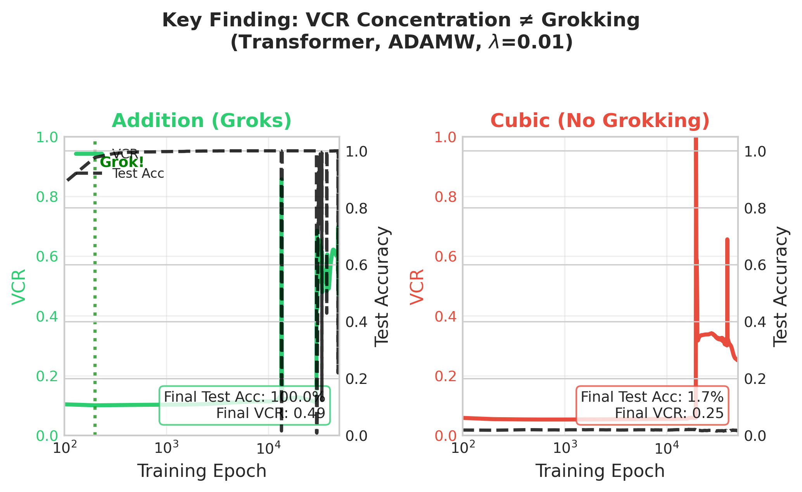

---

## Generated Figures

All figures are saved in `analysis/figures/` in both PNG and PDF formats.

### Main Figures (Modular Addition)

| Figure | Filename | Description |
|--------|----------|-------------|
| Fig 1 | `fig1_agop_schematic` | AGOP conceptual diagram |
| Fig 2 | `fig2_vcr_trajectories_weight_decay` | VCR trajectories across weight decays |
| Fig 3 | `fig3_vcr_generalization_alignment` | VCR vs generalization timing |
| Fig 4 | `fig4_weight_decay_phase_diagram` | Phase diagram of grokking regimes |
| Fig 5 | `fig5_architecture_comparison` | Transformer vs MLP comparison |
| Fig 6 | `fig6_optimizer_comparison` | AdamW vs Muon comparison |

### Supplementary Figures

| Figure | Filename | Description |
|--------|----------|-------------|
| Fig S1 | `figS1_eigenspectrum_heatmaps` | Full eigenspectrum evolution |
| Fig S2 | `figS2_nongrokking_eigenspectrum` | Non-grokking eigenspectrum |
| Fig S3-S7 | `figS3-S7_*` | Additional analysis |

### Comprehensive Grid Figures (Addition)

6x2 panels showing normalized VCR, train accuracy, and test accuracy across weight decays:

| Figure | Filename | Description |
|--------|----------|-------------|
| | `fig_comprehensive_transformer_discrete` | Transformer + Discrete tokens |
| | `fig_comprehensive_transformer_onehot` | Transformer + One-hot encoding |
| | `fig_comprehensive_mlp_discrete` | MLP + Discrete tokens |
| | `fig_comprehensive_mlp_onehot` | MLP + One-hot encoding |

### Cubic Polynomial Figures

| Figure | Filename | Description |
|--------|----------|-------------|
| Fig C1 | `fig_c1_vcr_trajectories_cubic` | VCR trajectories (cubic task) |
| Fig C2 | `fig_c2_phase_diagram_cubic` | Phase diagram (cubic task) |
| Fig C3 | `fig_c3_architecture_comparison_cubic` | Architecture comparison (cubic) |
| | `fig_comprehensive_cubic_transformer_discrete` | Full grid: Transformer + Discrete |
| | `fig_comprehensive_cubic_transformer_onehot` | Full grid: Transformer + One-hot |
| | `fig_comprehensive_cubic_mlp_discrete` | Full grid: MLP + Discrete |
| | `fig_comprehensive_cubic_mlp_onehot` | Full grid: MLP + One-hot |

### Comparative Analysis Figures

Direct comparisons between addition (grokking) and cubic (non-grokking) tasks:

| Figure | Filename | Description |
|--------|----------|-------------|
| COMP1 | `fig_comp1_vcr_side_by_side` | VCR trajectories side-by-side |
| COMP2 | `fig_comp2_vcr_distributions` | VCR distribution by task and outcome |
| COMP3 | `fig_comp3_key_finding` | Key finding: VCR is not sufficient |

### Comparison Grid Figures (Addition vs Cubic)

8 comprehensive 6x2 grid figures comparing both tasks across weight decays. Each figure shows a specific architecture + optimizer + input type combination:

| Figure | Filename | Takeaways |
|--------|----------|-----------|
| | `fig_comparison_grid_transformer_adamw_discrete` | **Clearest grokking signal.** Addition shows sharp VCR spikes at wd=1e-2 and 1e-1 with rapid generalization. Cubic shows similar VCR dynamics but flat test accuracy ~1%. |
| | `fig_comparison_grid_transformer_adamw_onehot` | Similar patterns to discrete. One-hot encoding doesn't fundamentally change the VCR-grokking relationship. |
| | `fig_comparison_grid_transformer_muon_discrete` | **Muon shows different VCR dynamics.** Lower peak VCR values for both tasks. Addition still groks but with more gradual VCR increase. |
| | `fig_comparison_grid_transformer_muon_onehot` | Muon + one-hot combination. VCR remains moderate; grokking still occurs for addition at higher weight decays. |
| | `fig_comparison_grid_mlp_adamw_discrete` | **MLP shows delayed/reduced grokking.** VCR spikes are present but generalization is slower or absent compared to transformer. |
| | `fig_comparison_grid_mlp_adamw_onehot` | MLP with one-hot inputs. Similar VCR patterns to discrete, confirming architecture effect dominates input type. |
| | `fig_comparison_grid_mlp_muon_discrete` | **Lowest VCR values overall.** Muon + MLP combination shows minimal VCR concentration for both tasks. |
| | `fig_comparison_grid_mlp_muon_onehot` | Similar to discrete. Muon optimizer consistently produces lower VCR regardless of architecture. |

### Key Takeaways from Comparison Grids

1. **VCR spikes occur in both tasks:** The cubic polynomial task shows VCR concentration comparable to the addition task, despite never generalizing. This is the **central finding** of this study.

2. **Grokking is task-dependent, not VCR-dependent:** The same VCR dynamics that predict grokking in modular addition fail to produce generalization in the cubic polynomial task.

3. **Optimizer effect is consistent:** Muon consistently produces lower VCR values than AdamW across both tasks and architectures.

4. **Architecture effect:** Transformers show more pronounced VCR spikes and more reliable grokking than MLPs.

5. **Weight decay is critical:** Both tasks require weight decay for VCR concentration, but only the addition task benefits from this regularization for generalization.

### Example: Transformer + AdamW + Discrete Comparison

This figure shows the clearest contrast between grokking and non-grokking scenarios:

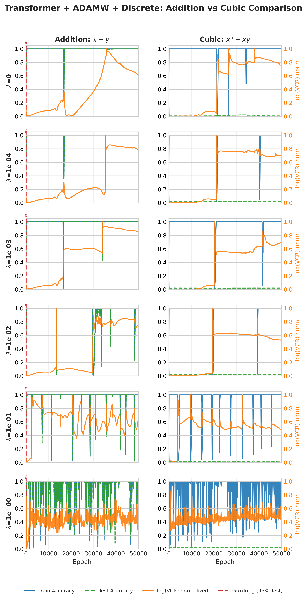

**Observations:**
- **Left column (Addition):** VCR spikes at wd=1e-2 and 1e-1 coincide with sharp increases in test accuracy (grokking)
- **Right column (Cubic):** Similar VCR dynamics occur, but test accuracy remains at chance level (~1%)
- **Both columns:** Training accuracy reaches 100% early, demonstrating memorization

### Example: Key Finding Visualization


This figure directly compares VCR trajectories between grokking (addition) and non-grokking (cubic) experiments, demonstrating that high VCR values do not guarantee generalization.

### VCR Trajectories: Addition vs Cubic Side-by-Side

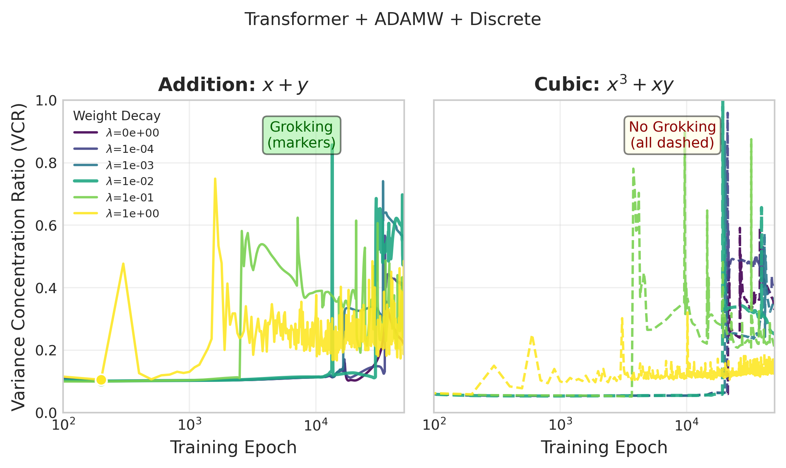

### VCR Distributions by Task and Outcome

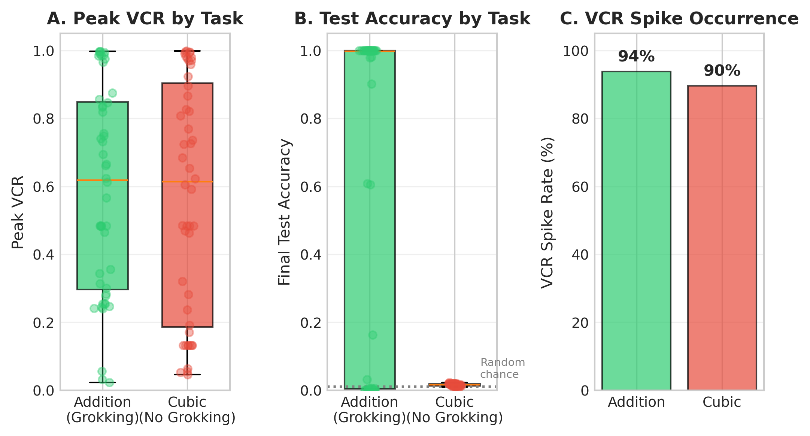

---

## Extended AGOP Metric Analysis

Beyond VCR, we analyzed all other AGOP-derived metrics to understand which properties distinguish grokking from non-grokking scenarios. Each metric was visualized in 6x2 comparison grids (rows = weight decay, columns = addition vs cubic).

### AGOP Metrics Analyzed

| Metric | Formula | Description |
|--------|---------|-------------|
| **Trace** | $\sum_i \lambda_i$ | Total gradient variance |
| **Eigengap** | $\lambda_1 - \lambda_2$ | Gradient alignment strength |
| **Spectral Radius** | $\lambda_1$ | Largest eigenvalue (max sensitivity) |
| **Frobenius Norm** | $\|\text{AGOP}\|_F$ | Total AGOP magnitude |
| **Top-5 Energy** | $\sum_{i=1}^{5} \lambda_i / \sum \lambda_i$ | Energy in top 5 eigenvectors |
| **Top-10 Energy** | $\sum_{i=1}^{10} \lambda_i / \sum \lambda_i$ | Energy in top 10 eigenvectors |
| **Subspace Similarity** | Cosine of top-k eigenvectors | Stability of gradient directions |

### Key Findings Across All AGOP Metrics

#### 1. **AGOP Trace (Total Gradient Variance)**

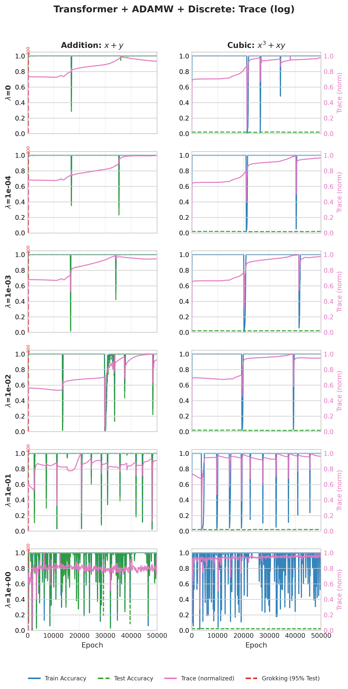

**Observations:**
- **Addition (grokking):** Trace decreases as training progresses, especially with higher weight decay. Sharp drops often coincide with grokking onset.
- **Cubic (no grokking):** Trace follows similar decreasing patterns but continues declining without generalization.
- **Conclusion:** Trace dynamics are similar between tasks — **trace alone does not distinguish grokking from non-grokking**.

#### 2. **AGOP Eigengap ($\lambda_1 - \lambda_2$)**

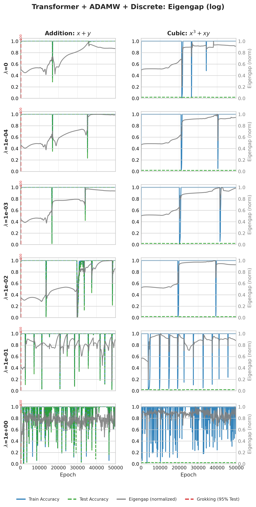

**Observations:**
- **Addition:** Eigengap increases during training, indicating gradients align to a dominant direction. Peaks correlate with grokking.
- **Cubic:** Eigengap also increases significantly, sometimes even more than addition.
- **Conclusion:** High eigengap (gradient alignment) is **not sufficient** for grokking. Both tasks show strong alignment.

#### 3. **AGOP Spectral Radius ($\lambda_1$)**

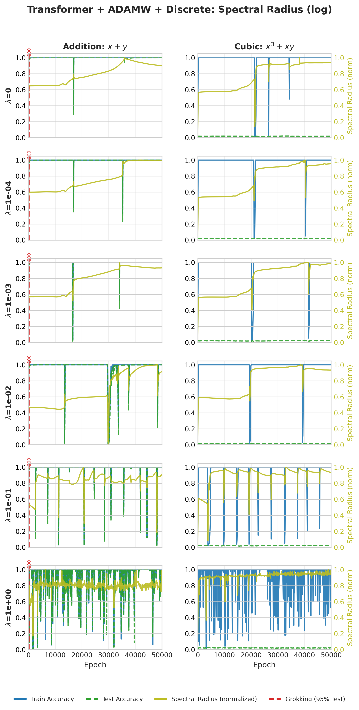

**Observations:**
- **Addition:** $\lambda_1$ shows characteristic spikes, especially at intermediate weight decays (1e-2, 1e-1).
- **Cubic:** Similar $\lambda_1$ dynamics — spikes occur at the same weight decay values.
- **Conclusion:** The largest eigenvalue behavior is **nearly identical** between tasks. This reinforces that the **gradient geometry is similar** even when generalization differs.

#### 4. **AGOP Frobenius Norm**

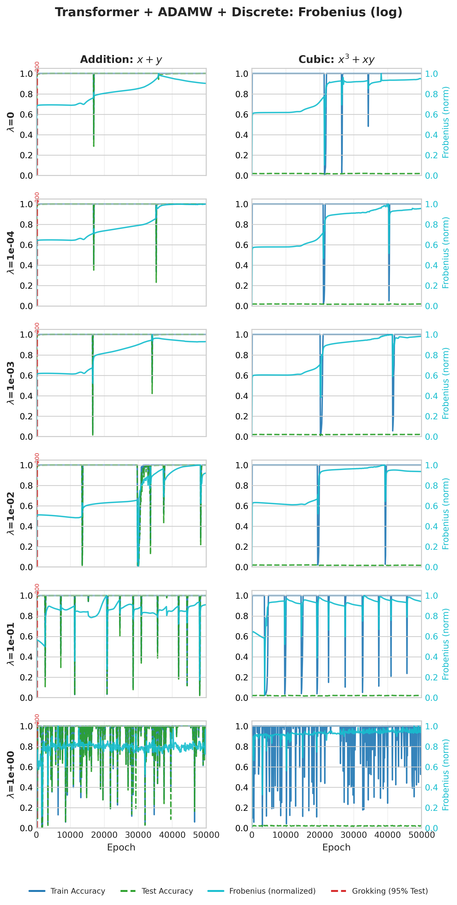

**Observations:**
- Both tasks show decreasing Frobenius norm with higher weight decay (regularization reduces gradient magnitudes).
- No clear difference between grokking and non-grokking experiments.
- **Conclusion:** Frobenius norm reflects overall gradient scale, **not task learnability**.

#### 5. **Top-5 and Top-10 Energy Ratios**

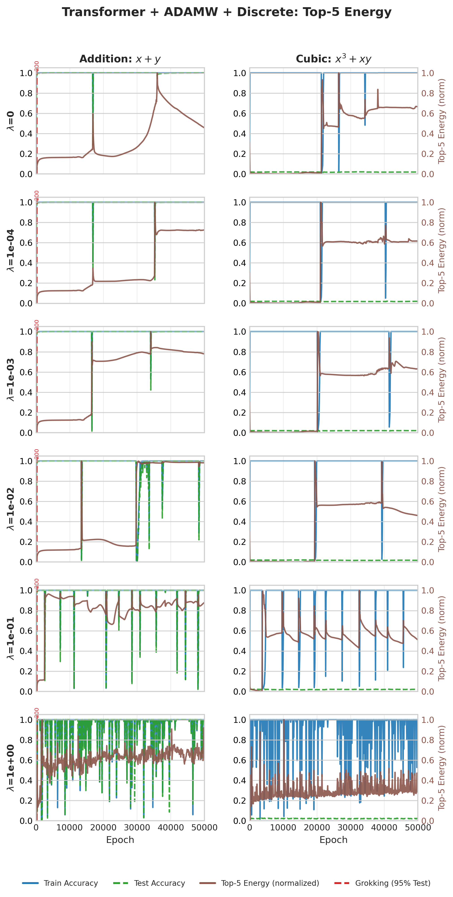

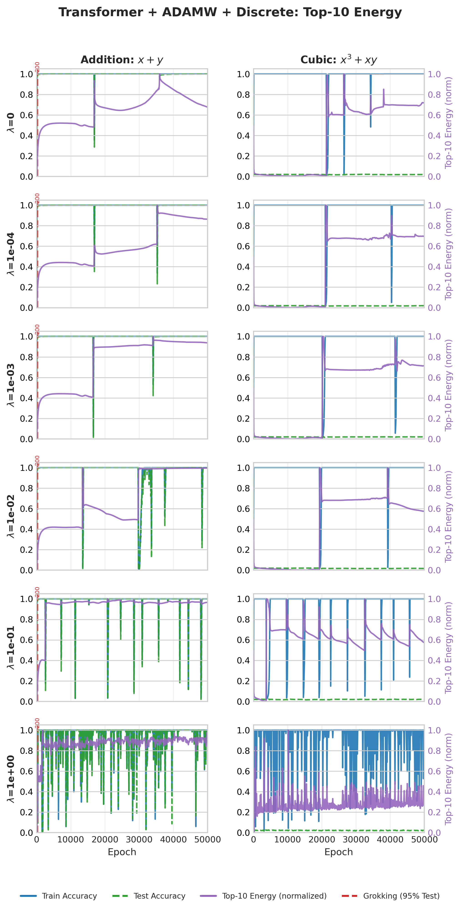

**Observations:**
- **Both tasks** achieve high energy concentration (>0.8 for top-5, >0.9 for top-10) in the principal eigenvectors.
- Cubic task sometimes shows **higher** energy concentration than addition!
- **Conclusion:** Energy concentration metrics behave **identically or even more extremely** in the non-grokking task. These are **not predictive of generalization**.

#### 6. **Subspace Similarity (Stability)**

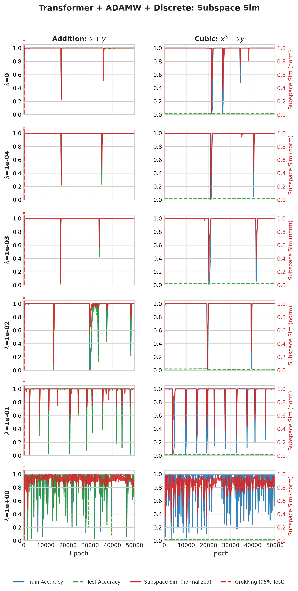

**Observations:**
- Subspace similarity measures how stable the top-k eigenvector directions are between consecutive checkpoints.
- **Addition:** Subspace stabilizes (high similarity) around grokking onset.
- **Cubic:** Subspace also stabilizes, but **no grokking occurs**.
- **Conclusion:** Stable gradient subspaces are necessary but **not sufficient** for grokking.

---

## Major Conclusions from Extended AGOP Analysis

### The Central Finding: AGOP Metrics Cannot Distinguish Grokking from Non-Grokking

| Metric | Addition (Grokking) | Cubic (No Grokking) | Distinguishes? |
|--------|---------------------|---------------------|----------------|
| VCR | High spikes (0.5-0.7) | High spikes (0.5-0.7) | ❌ No |
| Trace | Decreasing | Decreasing | ❌ No |
| Eigengap | Increasing | Increasing | ❌ No |
| Spectral Radius | Spikes present | Spikes present | ❌ No |
| Frobenius | Decreasing | Decreasing | ❌ No |
| Top-5 Energy | >0.8 | >0.8 (sometimes higher) | ❌ No |
| Top-10 Energy | >0.9 | >0.9 | ❌ No |
| Subspace Similarity | Stabilizes | Stabilizes | ❌ No |

### Implications

1. **Gradient geometry is task-agnostic:** The AGOP captures how the model's sensitivity is distributed across input directions, but this distribution evolves similarly regardless of whether the task is learnable.

2. **Grokking requires more than geometric concentration:** The cubic polynomial induces the same gradient concentration as modular addition, but the model cannot find the underlying pattern. This suggests:
   - The **task's algebraic structure** must be compatible with the model's inductive biases
   - Gradient concentration may be a **necessary condition** (all grokking experiments show it) but is **not sufficient**

3. **The "what" matters more than the "how much":** VCR and related metrics measure **how concentrated** gradients are, but not **which direction** they concentrate. The addition task may concentrate gradients along directions that encode modular structure, while cubic concentrates along unhelpful directions.

4. **Future work should analyze eigenvectors, not just eigenvalues:** The directions of concentration (AGOP eigenvectors) may reveal why addition groks and cubic doesn't.

---

## Summary Statistics

### Modular Addition
| Metric | Value |
|--------|-------|
| Total Experiments | 48 |
| Grokking Rate | ~50% (varies by configuration) |
| Peak VCR (grokking) | 0.5 - 0.7 |
| Best Weight Decay | 1e-2, 1e-1 |

### Cubic Polynomial  
| Metric | Value |
|--------|-------|
| Total Experiments | 48 |
| Grokking Rate | 0% |
| Peak VCR | 0.5 - 0.7 (similar to addition!) |
| Test Accuracy | ~1% (chance level) |

---

## Conclusions

1. **VCR is a geometric measure, not a generalization predictor:** High VCR indicates concentrated gradient sensitivity but doesn't guarantee learning the target function.

2. **Task structure matters:** The modular addition task has exploitable algebraic structure that enables generalization. The cubic polynomial, despite inducing similar gradient geometry, lacks this structure.

3. **Future directions:**
   - Investigate what additional conditions beyond VCR are needed for grokking
   - Explore other tasks with varying complexity
   - Study the role of input representation in enabling generalization

---

## Part VI: Additional Experiments for ICML Submission

The following experiments extend the analysis to test the hypothesis that **eigenvector directions** (not eigenvalue magnitudes) distinguish grokking from non-grokking tasks.

### Experiment 5: Contingency Analysis (Necessary but Not Sufficient)

**Status:** ✅ Implemented in notebook

Statistical analysis providing evidence that high VCR is necessary but not sufficient for grokking:
- Loads all 96 experiments (48 addition + 48 cubic)
- Builds 2×2 contingency table: Task vs Grokking outcome
- Fisher's exact test and odds ratio computation
- Visualization of test accuracy distributions by task

### Experiment 1: Eigenvector Direction Analysis

**Status:** 🔧 Framework ready (requires model checkpoints)

Compares top-k eigenvector directions between grokking and non-grokking tasks:
- Cosine similarity between corresponding eigenvectors
- Heatmap visualization of similarity over training epochs
- Tests whether cubic eigenvectors are "misaligned" with addition's principal directions

### Experiment 2: Eigenvector Interpretability Analysis

**Status:** 🔧 Framework ready (requires eigenvectors from Exp 1)

Analyzes whether addition eigenvectors encode interpretable modular structure:
- FFT analysis for cyclic patterns at period 97
- Symmetry tests (a-b component correlation)
- Visualization as 2×97 heatmaps

### Experiment 3: Representation Geometry Analysis

**Status:** 🔧 Framework ready (requires hidden representations)

Analyzes learned representations beyond gradients:
- Effective rank of representation matrix
- Local intrinsic dimension (TwoNN estimator)
- Centered Kernel Alignment (CKA) with labels

### Experiment 4: Task Complexity Spectrum

**Status:** 🔄 Extended (January 2026)

Tests intermediate-complexity tasks to establish a complexity-grokking curve:

| Task | Operation | Complexity |
|------|-----------|------------|
| Addition | $(a + b) \mod 97$ | Baseline (grokking) |
| Subtraction | $(a - b) \mod 97$ | Baseline |
| Multiplication | $(a \times b) \mod 97$ | Low |
| Division | $(a / b) \mod 97$ | Low-Medium |
| Quadratic | $(a^2 + b) \mod 97$ | Medium |
| Mixed Polynomial | $(a^2 + ab + b^2) \mod 97$ | Medium |
| **Pure Cubic** | $(a^3) \mod 97$ | Medium-High (NEW) |
| Symmetric Cubic | $(a^3 + b^3) \mod 97$ | High |
| Cubic | $(a^3 + ab) \mod 97$ | Highest (no grokking) |

**Extended Experiments (January 2026):** All 9 operations are now being tested with both 50/50 and 80/20 train/test splits, with the first 20 AGOP eigenvalues and eigenvectors tracked at each checkpoint.

### Experiment 6: Weight Matrix Subspace Analysis

**Status:** 🔧 Framework ready (requires model checkpoints)

Analyzes weight matrix structure:
- Singular value spectrum
- Low-rank approximation error
- Weight sparsity

---

## Running the New Experiments

### Task Complexity Sweep (16 experiments)
```bash
cd slurm_scripts
sbatch run_task_complexity_sweep.sh
```

This runs 4 new operations × 4 weight decays with transformer + adamw + discrete configuration.

### Run Notebook Analysis
```bash
cd slurm_scripts
sbatch run_notebook_analysis.sh
```

Executes the entire analysis notebook, including Experiment 5 (contingency analysis).

### Manual Execution of New Tasks
```bash
# Multiplication
python training_scripts/train_power_agop.py \
    --operation mul --weight_decay 0.01 --n_epochs 25000 \
    --save_dir ./results_mul

# Quadratic
python training_scripts/train_power_agop.py \
    --operation quadratic --weight_decay 0.01 --n_epochs 25000 \
    --save_dir ./results_quadratic

# Symmetric Cubic
python training_scripts/train_power_agop.py \
    --operation symmetric_cubic --weight_decay 0.01 --n_epochs 25000 \
    --save_dir ./results_symmetric_cubic

# Mixed Polynomial
python training_scripts/train_power_agop.py \
    --operation mixed_poly --weight_decay 0.01 --n_epochs 25000 \
    --save_dir ./results_mixed_poly
```

---

## References

1. Power, A., Burda, Y., Edwards, H., Babuschkin, I., & Misra, V. (2022). Grokking: Generalization beyond overfitting on small algorithmic datasets. *arXiv preprint arXiv:2201.02177*.

2. Nanda, N., Chan, L., Liberum, T., Smith, J., & Steinhardt, J. (2023). Progress measures for grokking via mechanistic interpretability. *arXiv preprint arXiv:2301.05217*.

---

## License

MIT License

