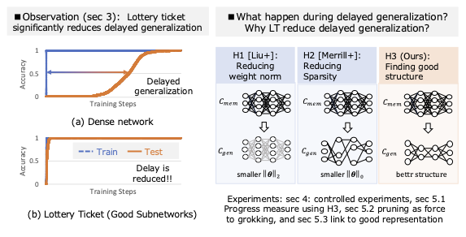
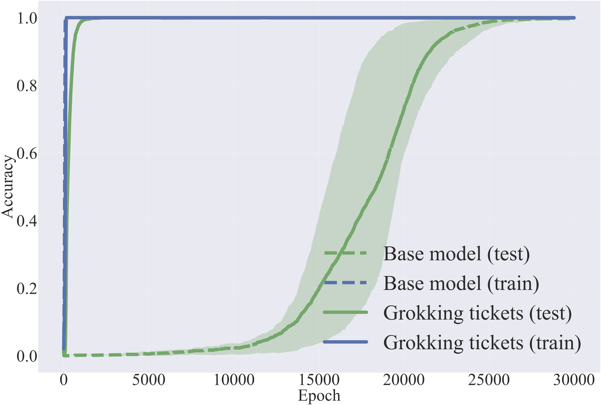

# Bridging Lottery Ticket and Grokking: Is Weight Norm Sufficient to Explain Delayed Generalization?

---
by Gouki Minegishi, Yusuke Iwasawa, Yutaka Matsuo  
[arXiv link](https://arxiv.org/abs/2310.19470)  

<p align="center">
  
</p>

## Setup

1. Create a virtual environment using Python 3.7.4. You can use either `pyvenv` or `conda` for this.
   ```bash
   python -m venv env   # For pyvenv
   conda create -n myenv python=3.7.4   # For conda
   ```
2. install the required dependencies.
   ```bash
   pip install -r requirements.txt
   ```

## Configuration
- configs/config.py : Modular Addition task
- configs/config_mnist.py : Mnist Cllasification task

## Training Base Model (Dense)
### Modular addition

```bash
python train.py --config configs/config.py
```
Training confguration is written in `config/config.py`.

### Mnist

```bash
python train_mnist.py --config configs/config_mnist.py
```
Training confguration is written in `config/config_mnist.py`.

## Grokking Tickets
### Modular addition
```bash
python prune.py --config configs/config_pruning.py
```
Training confguration is written in `config/config_pruning.py`.
### Mnist
```bash
python prune_mnist.py --config configs/config_pruning_mnist.py
```

Training confguration is written in `config/config_pruning_mnist.py`.
## Relusts
You can check the experimental results from wandb.  　　
The following figure compares the Base Model (Dense) and the Grokking Ticket. It can be observed that the Grokking Ticket almost eliminates delayed generalization.
<p align="center">

</p>

## Visualize
The following command visualizes the difference in the acquisition dynamics of representations between the Base Model (left) and the Grokking Ticket (right).  
```bash
python visualize.py --grok_weight_path <path to grok weight> ----weight_folder <path to base weight folder> --ticket_folder <path to ticket folder> --output_folder <path to output folder>
```
 
