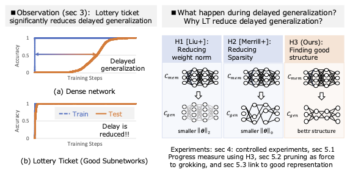
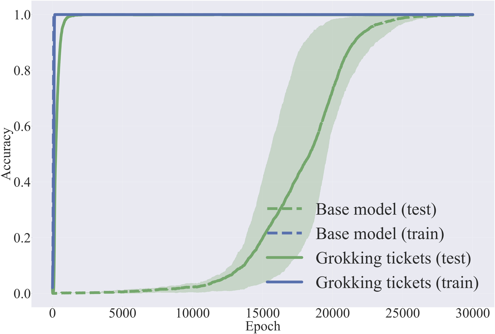
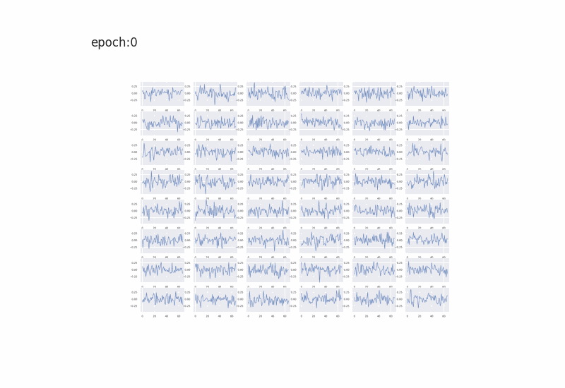
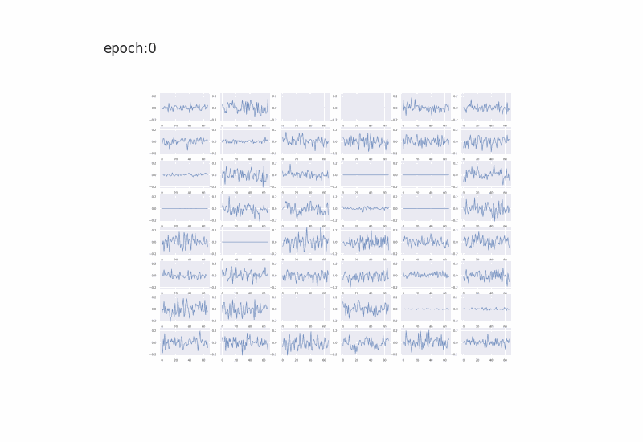

# Bridging Lottery Ticket and Grokking: Is Weight Norm Sufficient to Explain Delayed Generalization?

---
by Gouki Minegishi, Yusuke Iwasawa, Yutaka Matsuo  
[arXiv link](https://arxiv.org/abs/2310.19470)  

<p align="center">
  
</p>

## Setup

1. Create a virtual environment using Python 3.7.4. You can use either `pyvenv` or `conda` for this.
   ```bash
   python -m venv env   # For pyvenv
   conda create -n myenv python=3.7.4   # For conda
   ```
2. install the required dependencies.
   ```bash
   pip install -r requirements.txt
   ```

## Configuration
- configs/config.py : Modular Addition task
- configs/config_mnist.py : Mnist Cllasification task

## Training Base Model (Dense)
### Modular addition

```bash
python train.py --config configs/config.py
```
Training confguration is written in `config/config.py`.

### Mnist

```bash
python train_mnist.py --config configs/config_mnist.py
```
Training confguration is written in `config/config_mnist.py`.

## Grokking Tickets
### Modular addition
```bash
python prune.py --config configs/config_pruning.py
```
Training confguration is written in `config/config_pruning.py`.
### Mnist
```bash
python prune_mnist.py --config configs/config_pruning_mnist.py
```

Training confguration is written in `config/config_pruning_mnist.py`.
## Relusts
You can check the experimental results from wandb.  　　
The following figure compares the Base Model (Dense) and the Grokking Ticket. It can be observed that the Grokking Ticket almost eliminates delayed generalization.
<p align="center">

</p>

## Visualize
The following command visualizes the difference in the acquisition dynamics of representations between the Base Model (left) and the Grokking Ticket (right).  
```bash
python visualize.py --grok_weight_path <path to grok weight> ----weight_folder <path to base weight folder> --ticket_folder <path to ticket folder> --output_folder <path to output folder>
```
 
# Replication Guide: Grokking Tickets - Lottery Tickets Accelerate Grokking

This directory contains the Grokking-Tickets repository connecting lottery ticket hypothesis with grokking.

## Original Paper

**Grokking Tickets: Lottery Tickets Accelerate Grokking**

- **Authors:** Gouki Minegishi, Yusuke Iwasawa, Yutaka Matsuo
- **Paper:** [arXiv:2310.19470](https://arxiv.org/abs/2310.19470)
- **Original Repo:** https://github.com/gouki510/Grokking-Tickets

## Key Contributions

- Identifies "Grokking tickets" - sparse subnetworks that accelerate grokking
- Shows grokking can occur even without weight decay using good subnetworks
- Demonstrates that subnetwork structure matters, not just weight norm

## Quick Start

### Installation

```bash
pip install -r requirements.txt
```

### Running with SLURM

```bash
chmod +x run_lottery_ticket.sh
sbatch run_lottery_ticket.sh
```

### Running Locally

```bash
python main.py \
    --dataset=modular_addition \
    --pruning_rate=0.6 \
    --seed=42
```

## Key Experiments

### 1. Find Grokking Tickets
Train full network, prune at generalization, retrain:

```bash
# Step 1: Train to generalization
python main.py --stage=train_full --dataset=modular_addition

# Step 2: Prune at generalization (28k steps typically)
python main.py --stage=prune --checkpoint=generalization --pruning_rate=0.6

# Step 3: Retrain pruned network
python main.py --stage=retrain --use_mask=True
```

### 2. Compare Pruning at Different Stages

**At initialization (random ticket):**
```bash
python main.py --prune_at=init --pruning_rate=0.6
```

**At memorization (2k steps):**
```bash
python main.py --prune_at=memorization --pruning_rate=0.6
```

**At generalization (28k steps):**
```bash
python main.py --prune_at=generalization --pruning_rate=0.6
```

### 3. Vary Pruning Rate

```bash
for rate in 0.2 0.4 0.6 0.8 0.9; do
    python main.py --pruning_rate=$rate --prune_at=generalization
done
```

## Expected Results

- **Grokking tickets** (from generalization) accelerate grokking dramatically
- Tickets from earlier stages (init, memorization) don't accelerate
- Optimal pruning rate around 60%
- Can achieve grokking even with weight_decay=0 using good tickets

## Repository Structure

- `main.py`: Main training and pruning script
- `models/`: Model architectures (transformer, MLP)
- `data/`: Dataset generation
- `pruning/`: Magnitude pruning implementation
- `analysis/`: Analysis scripts and notebooks

## Important Parameters

- **pruning_rate**: Fraction of weights to prune (0.6 recommended)
- **prune_at**: Stage to identify ticket (init/memorization/generalization)
- **global_pruning**: Whether to prune globally across layers (True recommended)

## For Gradient Analysis

This repository is particularly interesting because:
1. Can compare gradient dynamics in dense vs sparse networks
2. Study how pruning affects gradient outer product structure
3. Investigate why tickets found at generalization work better

## Datasets Supported

- Modular addition
- MNIST
- Custom datasets can be added

## Citation

```bibtex
@article{minegishi2023grokking,
  title={Grokking tickets: Lottery tickets accelerate grokking},
  author={Minegishi, Gouki and Iwasawa, Yusuke and Matsuo, Yutaka},
  journal={arXiv preprint arXiv:2310.19470},
  year={2023}
}
```

